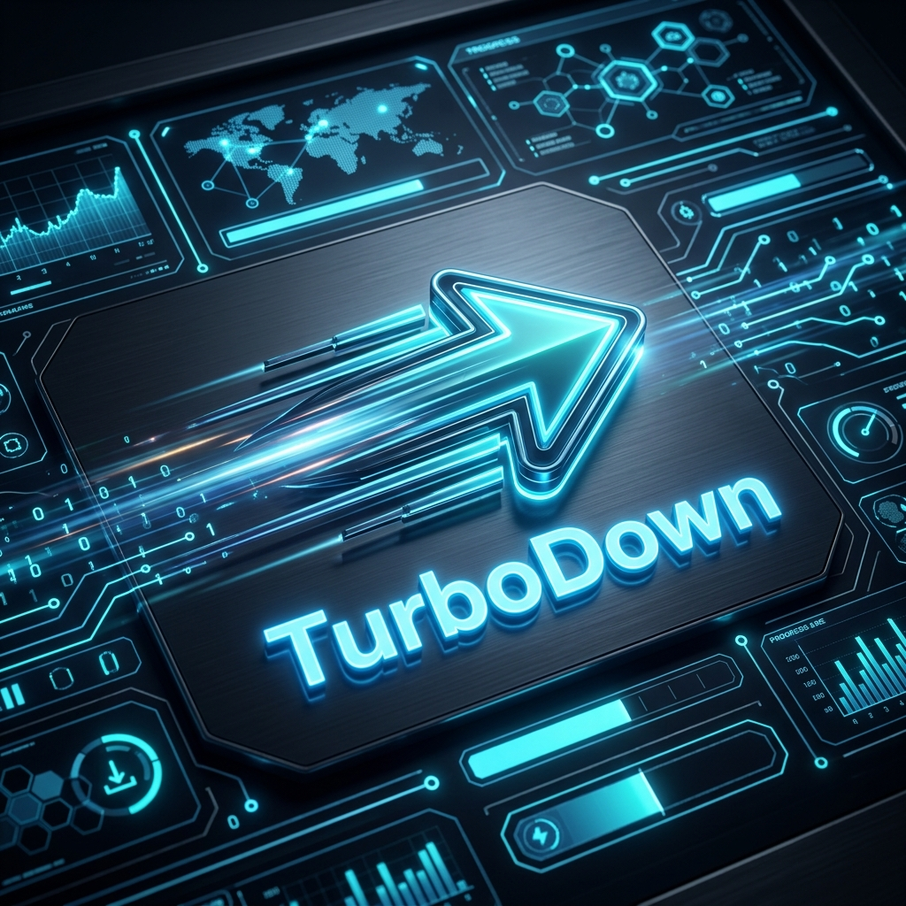

# ⬇️ TurboDown - Ultimate Download Manager & Accelerator

<p align="center">
  
</p>

**TurboDown** is a highly optimized, feature-rich, and open-source download manager and accelerator written in Python. Designed to maximize your download speeds with a stunning modern dark-themed GUI and a powerful asynchronous multi-threaded engine, TurboDown represents the ultimate open-source alternative to proprietary download utilities.

---

## 🚀 Key Features

1. **Ultra-Fast Multi-Threaded Engine (64 to 128 Connections):**
   * Automatically splits files into up to **128 concurrent connections**, maximizing your bandwidth usage to download files up to 10x faster.
2. **Robust Pause & Resume (Cooperative Control):**
   * Engineered with an advanced async queue system to safely pause and resume downloads at any time without file corruption or locks.
3. **Smart Auto-Retry with Exponential Backoff:**
   * Automatically handles transient network issues by retrying downloads up to **10 times** per connection part, using an intelligent backoff delay.
4. **Professional YouTube Video Grabber:**
   * Instantly extract and download YouTube videos in any resolution (4K, 1080p, 720p) or extract high-quality audio (MP3, M4A) with a single click.
5. **Smart Clipboard Monitor:**
   * Runs in the background and automatically intercepts direct download links, YouTube video links, or torrent/magnet links from your clipboard.
6. **Magnet Link & Torrent Forwarding:**
   * Instantly detects magnet links and prompts you to launch them directly in your default BitTorrent client (e.g., qBittorrent).
7. **Complete Browser Integration (Chrome, Edge, Brave, Firefox):**
   * Features dedicated web extensions that automatically intercept standard browser downloads and inject a professional, floating overlay directly onto the YouTube video player.
8. **Speed Limiter & Download Scheduler:**
   * Manage your network consumption with custom speed limits, or schedule your downloads to start and stop at specified times.
9. **System Tray Integration & Notifications:**
   * Minimizes silently to the system tray near the clock, keeping you updated with native OS notifications, sound prompts, and a post-download action dialogue.

---

## 🛠️ Installation & Setup

### 1. Install Python
Ensure you have [Python 3.10+](https://www.python.org/downloads/) installed on your system.

> [!IMPORTANT]
> Make sure to check the **"Add Python to PATH"** option during installation.

### 2. Install Required Dependencies
Open a terminal in the project directory and run:
```bash
pip install -r requirements.txt
```

### 3. FFMPEG Setup (Optional - For Merging High-Definition YouTube Video and Audio)
To merge 1080p/4K YouTube video streams with their corresponding audio streams, the app relies on **FFMPEG**.

* The program attempts to download FFMPEG automatically via the `imageio-ffmpeg` library.
* If it fails to run automatically, follow these manual steps:
  1. Download FFMPEG from [ffmpeg.org](https://ffmpeg.org/download.html).
  2. Extract the file and place it in a permanent folder.
  3. Add the path to the `bin` directory of FFMPEG to your system's Environment Variables (**PATH**).
  4. Verify the installation by running `ffmpeg -version` in your command prompt.

---

## 🔌 Browser Extension Installation

### For Google Chrome / Microsoft Edge / Brave:
1. Open the extensions page in your browser: `chrome://extensions` (or `edge://extensions`).
2. Enable **Developer Mode** using the toggle switch in the top-right corner.
3. Click on the **Load unpacked** button.
4. Select the **`extension`** folder located inside the TurboDown directory.

### For Mozilla Firefox:
1. Open the debugging page in Firefox: `about:debugging#/runtime/this-firefox`.
2. Click on the **Load Temporary Add-on...** button.
3. Choose the `manifest.json` file inside the **`extension_firefox`** folder.

---

## 🚀 How to Run

### Method 1: Using the Batch Launcher (Windows)
Double-click the **`start.bat`** file in the root of the project directory. This batch file automatically verifies your Python installation, installs missing dependencies, and boots the application.

### Method 2: Silent Launch (No Console Window)
Double-click the **`TurboDown.vbs`** file. This starts the application silently in the background (minimized to your system tray) without opening a black command prompt window.

### Method 3: Command Line
```bash
python app.py
```

---

## 📂 Project Structure

```
TurboDown/
├── app.py                  # Main GUI Application (CustomTkinter)
├── downloader.py            # High-Performance Asynchronous Download Engine
├── video_grabber.py         # YouTube Video Scraper & yt-dlp wrapper
├── integration_server.py    # Flask Local Server for Browser Extension integration
├── start.bat               # Interactive dependency installer and launcher
├── TurboDown.vbs           # Silent background windowless launcher
├── requirements.txt         # Required Python packages
├── README.md               # Project documentation
├── LICENSE                  # MIT License
├── assets/                 # Repository assets
│   └── banner.png          # Promotional banner
├── extension/              # Chrome/Edge Extension (Manifest V3)
└── extension_firefox/       # Firefox Extension (Manifest V2)
```

---

## 📄 License
This project is licensed under the **MIT License** - see the [LICENSE](LICENSE) file for details.
